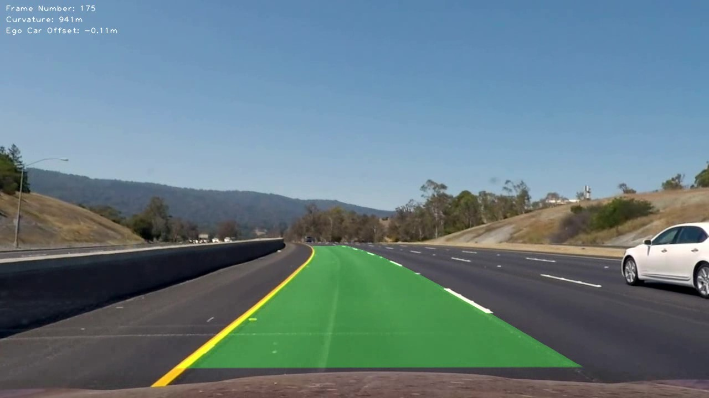

# Lane Finding

Author: Jesse Prescott

Advanced lane finding project submission for the Udacity Self-Driving Car Engineer Nanodegree.

A thorough explanation as to how it works can be found in "writeup.pdf"

# Usage

## Calibrating Camera
Before using the script, camera calibration must be performed. To do this, run the python script "calibration.py". It requires the location of a folder containing at lest 8 checkerboard images. The size of the checkboard can be changed in the script.  
  
The calibration will be placed in the execution directory in a file called "calibration.npy".

## Detecting Center Lane

Run the "find_lanes.py" script and pass the location of your original video file and the calibration file you made earlier. The final video will be placed in the execution directory in a file called "output.mp4".
